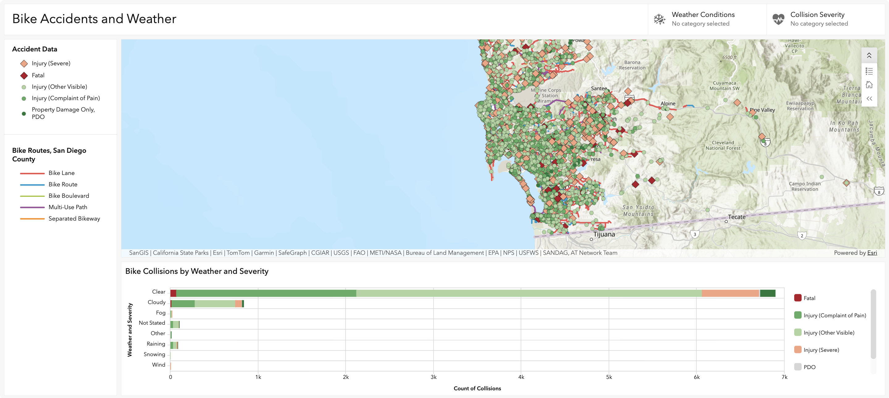
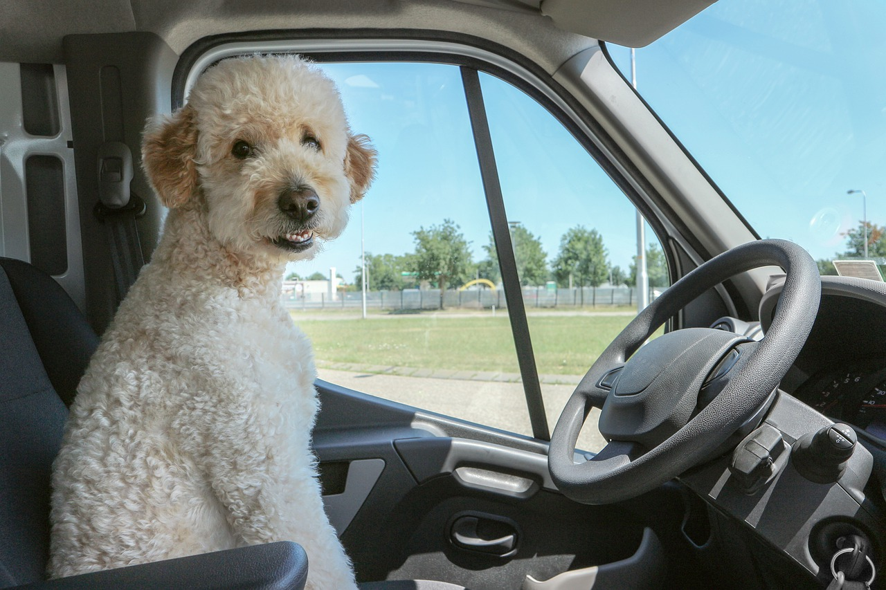

# Mapping San Diego Bicycle Risk

> An interactive web mapping project exploring where, when, and why cyclists face the greatest risk across San Diego County.

Built by a team of four using **ArcGIS** and **CARTO**, this project combines collision records and infrastructure data to visualize bicycle safety across San Diego County.

This project examines how infrastructure, weather, driver behavior, and alcohol involvement shape bicycle risk across the region. By mapping these patterns, the team highlights areas where cyclists may face the greatest danger and where safety improvements may be most needed.

## Project Goals

This project uses spatial analysis to better understand the factors that contribute to bicycle crashes and injuries. The goal is to identify patterns that can inform safer cycling conditions and more effective transportation planning.

---

Browse each team member's map below to explore a different dimension of bicycle safety.

<a href="./Sebastian/">

Image credit

<h3>Map 1 — Bike Protection Gap</h3>

<b>By: Sebastian</b> 
Explore how collision severity and bicycle infrastructure overlap to identify areas where cyclist safety may be most at risk.

<b>Tools Used:</b> 
ArcGIS

</a>

<a href="./Devon/">

&nbsp;

<h3>Map 2 — Weather Conditions</h3>

<b>By: Devon</b> 
Examine how weather conditions and collision severity relate to bicycle crashes across San Diego County.

<b>Tools Used:</b> 
ArcGIS

</a>

<a href="./Isaac/">

Image credit

<h3>Map 3 — Driver Behavior</h3>

<b>By: Isaac</b> 
Analyze aggressive driving patterns and relationships with bicycle safety.

<b>Tools Used:</b> 
ArcGIS

</a>

<a href="./Amy/index.html">

&nbsp;

<h3>Map 4 — Alcohol Involvement</h3>

<b>By: Amy</b> 
Highlight the role of alcohol in bicycle collisions and show where injury risk is concentrated near areas with limited infrastructure.

<b>Tools Used:</b> 
CARTO

</a>

## Data Sources

- [SWITRS — California Statewide Integrated Traffic Records System](https://opendata.sandag.org/Transportation/SWITRS-Collisions-Records-2014-2023-/uzct-sb5t/about_data): crash records used to identify collision locations, severity, and patterns.
- [City of San Diego Open Data Portal](https://data.sandiego.gov/datasets/traffic-collision-details/#getData): local street and infrastructure data used to compare crash locations with existing bike facilities.
- [SANDAG Regional GIS Data](https://opendata.sandag.org/Geographic-Information-Systems/iBikeMap/fzya-dg8s): regional transportation and planning data used to contextualize the maps within the broader San Diego area.

---

## Tools Used

| Tool | Purpose |
|------|---------|
| ArcGIS | Used to build interactive dashboards and visualize collision and infrastructure patterns |
| CARTO | Used for web-based map visualization and spatial storytelling |
| GitHub Pages | Used to host and publish the project website |

---

## Team

| Name | Focus Area |
|------|-----------|
| Sebastian | Infrastructure and collision hotspot analysis |
| Devon | Weather conditions and crash severity patterns |
| Isaac | Driver behavior and road safety relationships |
| Amy | Alcohol-related collisions and injury risk |

---

*GEOG 583 · San Diego State University · Summer 2026*
