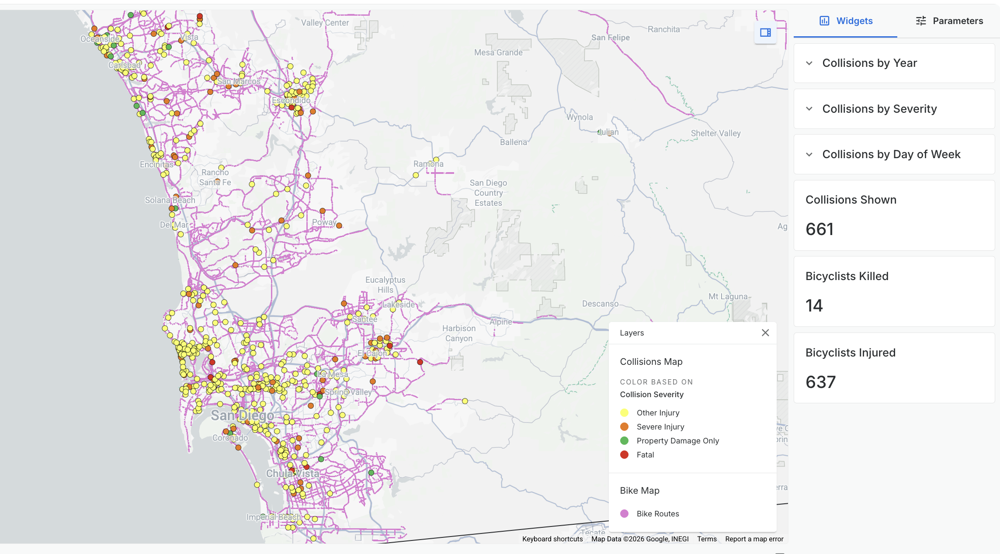

# Mapping San Diego Bicycle Risk

> An interactive web mapping project exploring where, when, and why cyclists face the greatest risk across San Diego County.

Built by a team of four using **ArcGIS** and **Leaflet**, this project combines collision records and infrastructure data to visualize bicycle safety across the county.

---

<a href="./Sebastian/index.html">

<h3>Map 1 — Bike Protection Gap</h3>

<b>By: Sebastian</b> 
Overlay collision severity hotspots against bikeways and bike infrastructure to examine whether severe cyclist injuries occur in areas lacking protection.

</a>

<a href="./Devon/index.html">

<h3>Map 2 — Weather Conditions</h3>

<b>By: Devon</b> 
Explore how weather conditions relate to bicycle collisions throughout San Diego County.

</a>

<a href="./Isaac/index.html">

<h3>Map 3 — Driver Behavior</h3>

<b>By: Isaac</b> 
Analyze aggressive driving patterns and relationships with bicycle safety.

</a>

<a href="./Amy/index.html">

<h3>Map 4 — Alcohol Involvement</h3>

<b>By: Amy</b> 
Map alcohol-related bicycle incidents by location and timing patterns.

</a>

## Data Sources

- [SWITRS — California Statewide Integrated Traffic Records System](https://iswitrs.chp.ca.gov)
- [City of San Diego Open Data Portal](https://data.sandiego.gov)
- [SANDAG Regional GIS Data](https://sandag.org)

---

## Tools Used

| Tool | Purpose |
|------|---------|
| Leaflet | Interactive map rendering and layer control |
| Carto | Interactive map rendering, file processing and layer control |
| Mapbox | Basemap tiles and custom styling |
| GitHub Pages | Hosting and deployment |

---

## Team

| Name | Focus Area |
|------|-----------|
| Sebastian | Collision/Infrastructure hotspots |
| Devon | Weather/Public Safety Risk |
| Isaac | Events/Angry Driver risk |
| Amy | Alcohol Risk |

---

*GEOG 583 · San Diego State University · Summer 2026*
